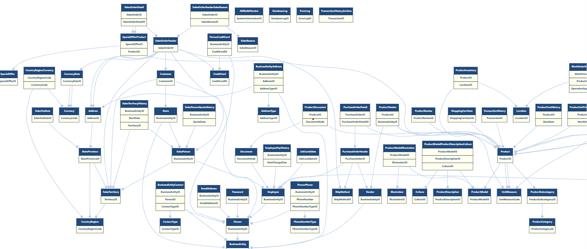
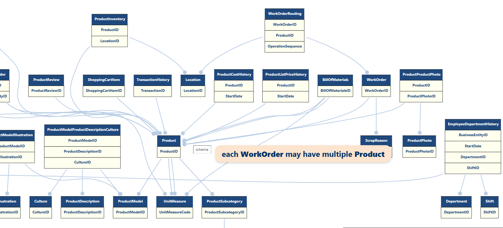

# AdventureWorks Schema Visualizer

This project is a full-stack schema visualizer for the **AdventureWorks** database, developed using **C# (.NET)**, **MSAGL**, **Graphviz**, and **HTML/CSS/JS**. It extracts relational structure from a SQL Server instance and renders it as an interactive, stylized graph with custom tooltips and HTML-enhanced SVG output.

This tool was designed to help database engineers, backend developers, and data architects quickly understand the logical relationships between tables in a clean, web-ready format.

## Features

- Automated extraction of primary and foreign keys from SQL Server
- MSAGL graph construction with directional edges
- Graphviz-style layout rendering with enhanced label formatting
- HTML-like node structure with two-tone styling (header/body)
- SVG output with embedded tooltips
- HTML viewer with custom-styled tooltips on hover
- Supports both full schema overview and lightweight preview

## Diagram Samples

**Full Schema View:**

**Tooltip Demo:**

## Files Included

- `diagramFull.png` – full view of the rendered schema
- `diagram.png` – a cropped interactive diagram demonstrating the tooltip functionality
- `index.html` – interactive viewer (SVG embedded with hover tooltips)
- `graph_output.dot` – the DOT file describing the graph structure
- `graph_output.svg` – static rendered SVG using Graphviz
- `.cs` files – the full source code for retrieving data and generating the output
- `README.md` – this documentation

## How It Works

The tool connects to a local SQL Server instance (tested with **SSMS 21**) hosting the **AdventureWorks** database. It queries system tables to extract:

- Table names
- Primary key columns
- Foreign key relationships

It then constructs a graph using **MSAGL** and exports a `.dot` file that is rendered with **Graphviz**. HTML-like labels are used to achieve a two-tone visual layout. Finally, the output is wrapped in a custom `index.html` file that enables interactive tooltips using JavaScript and CSS.

## Viewing the Diagram

To view the interactive version of the schema:

1. Ensure that your local environment has access to **Microsoft SQL Server** (AdventureWorks installed) and Graphviz.
2. If you're using the original `.cs` code, make sure your connection string in the code matches your local server settings.
3. Run the application to generate updated `.dot`, `.svg`, and `.html` files.
4. Open `index.html` in your browser to view the interactive diagram with tooltips.
5. If you only want a static overview, refer to `diagramFull.png`.

**Note**: The tool assumes access to a local SQL Server instance. If you're cloning the repo to explore the visualization only, you can skip setup and simply open the provided `.html` or `.png` files.

## Limitations

Due to the use of HTML-like labels in Graphviz, native shape styling (such as rounded corners) is restricted. More advanced customization would require low-level rendering or alternate visualization libraries.

## License

This project is released for educational and demonstration purposes. Attribution required if used in derivative work.
